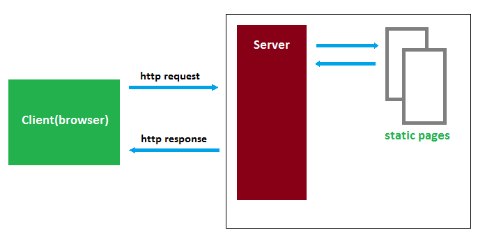

# RabbitMQ

> This is a tutorial course covering RabbitMQ.

Tools used:

- JDK 11
- Maven
- JUnit 5, Mockito
- IntelliJ IDE

## Table of contents

1. Introduction to RabbitMQ

---

## Chapter 01. Introduction to RabbitMQ

### Queues

In computer science, queue is a collection of entities maintained in a sequence.

Queue is a linear data structure that is open at both ends and the operations are performed in First-In-First-Out (FIFO)
order.

Sequence can be modified by:

- adding entities to the beginning or to the end
- removing from the beginning or from the end

**_Synchronous Communication_**

Example: HTTP, RESTful API, WebServices, RPC etc.

This has a simple request-response model where a client sends a request to server and gets the response back.

Best for requests with really short execution time.

**_Asynchronous Communication_**

Example: AMQP, Queues etc.

Client gets the request **acknowledgement** back from the server immediately but can continue doing other tasks rather
than waiting for the server to send the complete response (results).

Results will be received at some point in the future without blocking.

Thus, the basic difference is:

