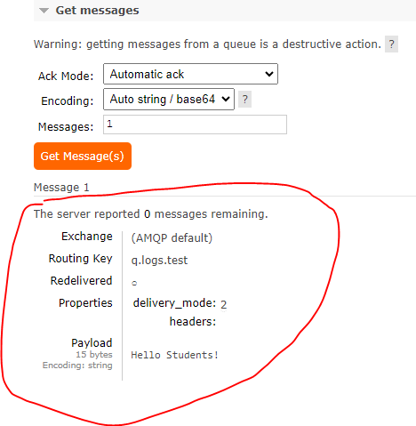
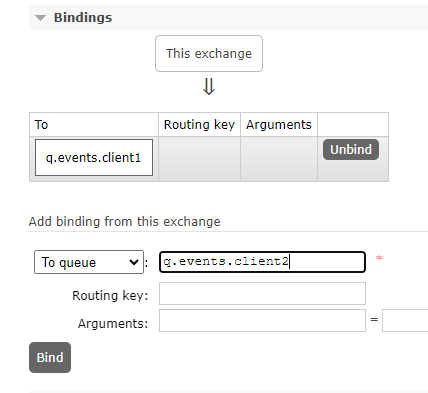

# RabbitMQ

> This is a tutorial course covering RabbitMQ.

Tools used:

- JDK 11
- Maven
- JUnit 5, Mockito
- IntelliJ IDE

## Table of contents

1. [Introduction to RabbitMQ](https://github.com/backstreetbrogrammer/44_RabbitMQ?tab=readme-ov-file#chapter-01-introduction-to-rabbitmq)
    - [Queues](https://github.com/backstreetbrogrammer/44_RabbitMQ?tab=readme-ov-file#queues)
    - [RabbitMQ](https://github.com/backstreetbrogrammer/44_RabbitMQ?tab=readme-ov-file#rabbitmq)
2. [RabbitMQ Installation](https://github.com/backstreetbrogrammer/44_RabbitMQ?tab=readme-ov-file#chapter-02-rabbitmq-installation)
3. [RabbitMQ Deep Dive](https://github.com/backstreetbrogrammer/44_RabbitMQ?tab=readme-ov-file#chapter-03-rabbitmq-deep-dive)
    - [Exchange](https://github.com/backstreetbrogrammer/44_RabbitMQ?tab=readme-ov-file#exchange)
    - [Queue Concepts](https://github.com/backstreetbrogrammer/44_RabbitMQ?tab=readme-ov-file#queue-concepts)
4. [RabbitMQ Hands On](https://github.com/backstreetbrogrammer/44_RabbitMQ?tab=readme-ov-file#chapter-04-rabbitmq-hands-on)
    - [Simple Queue](https://github.com/backstreetbrogrammer/44_RabbitMQ?tab=readme-ov-file#simple-queue)
    - [Work Queues or Task Queues](https://github.com/backstreetbrogrammer/44_RabbitMQ?tab=readme-ov-file#work-queues-or-task-queues)
    - [Publish-Subscribe Fan-out](https://github.com/backstreetbrogrammer/44_RabbitMQ?tab=readme-ov-file#publish-subscribe-fan-out)

---

## Chapter 01. Introduction to RabbitMQ

### Queues

In computer science, queue is a collection of entities maintained in a sequence.

Queue is a linear data structure that is open at both ends and the operations are performed in First-In-First-Out (FIFO)
order.


Sequence can be modified by:

- adding entities to the back / tail / rear
- removing from the front / head

**_Synchronous Communication_**

Example: HTTP, RESTful API, WebServices, RPC etc.

This has a simple request-response model where a client sends a request to server and gets the response back.

Best for requests with really short execution time.


**_Asynchronous Communication_**

Example: Advanced Message Queuing Protocol (AMQP)

The client gets the request **acknowledgement** back from the server immediately but can continue doing other tasks
rather than waiting for the server to send the complete response (results).

Results will be received at some point in the future without blocking.


Thus, the basic difference is:


**_Most important queue attributes_**

- **Queue Size**: number of messages in the queue
- **Queue Age**: age of the oldest message in the queue

For example, if a queue has only 10 messages (size=10) but age is 5 minutes => messages are not consumed fast enough
or at all.

Similarly, if a queue has 1 million messages but age is 5 seconds => produce and consumption rate is 200_000
messages per seconds.

### RabbitMQ

**RabbitMQ** is an open-source message-broker software (sometimes just called queuing software) that originally
implemented the Advanced Message Queuing Protocol (AMQP).

RabbitMQ supports plugins—standard distribution contains plugins to support protocols like Streaming Text Oriented
Messaging Protocol (STOMP), Message Queuing Telemetry Transport (MQTT), and others.

RabbitMQ is written in **Erlang** Programming Language. Erlang is a functional language, designed to build massively
scalable real-time systems with high-availability requirements.

Erlang processes:

- are very light (memory footprint)
- start very fast
- operate in isolation from other processes
- are scheduled by Erlang's Virtual Machine (default limit of Erlang processes for RabbitMQ is one million)

**_RabbitMQ vs Kafka_**

|                                                 | RabbitMQ                                                  | Kafka                                                             |
|-------------------------------------------------|-----------------------------------------------------------|-------------------------------------------------------------------|
| Released                                        | June 2007                                                 | January 2011                                                      |
| General purpose                                 | messages broker (queue)                                   | messages bus (stream processing - log)                            |
| Messages replay                                 | no                                                        | yes                                                               |
| Consumer                                        | dummy consumer / push model                               | smart consumer / pull model                                       |
| Data throughput (relative to single shard/node) | high (no quoted throughput)                               | highest (no quoted throughput)                                    |
| Data consistency                                | highest (ACKs)                                            | high                                            <br/>             |
| Persistence period                              | no limit                                                  | no limit                                                          |
| Maintenance effort                              | high                                                      | highest                                                           |
| Cost                                            | relatively small                                          | relatively normal                                                 |
| Open Source                                     | yes                                                       | yes                                                               |
| Availability                                    | highly available                                          | highly available, but Zookeeper is needed to manage cluster state |
| Performance                                     | high                                                      | very high - higher throughput                                     |
| Replication                                     | queues are not replicated by design                       | by design                                                         |
| Protocols                                       | standard queue protocols like AMQP, STOMP, HTTP, and MQTT | binary serialized data                                            |
| Storage type                                    | queue                                                     | log                                                               |
| Acknowledgments                                 | sophisticated                                             | basic                                                             |
| Routing                                         | very flexible (exchange, binding keys)                    | message is sent to the topic by a key                             |

**_AMQP Protocol_**

AMQP is an open standard **application layer** protocol:

- Designed for asynchronous communication
- AMQP standardizes the behavior of the messaging publisher and consumer
- Platform independent
- Technology independent (many SDKs)


AMQP Message is a package of information:

- **Header** (key-value pairs): Metadata — defined by AMQP specification
- **Properties** (key-value pairs): Metadata — application-specific information holder
- **Body** (payload, actual message): `byte[]`

Message limit is `2GB`, but it's better to avoid such a big message if possible.

Message is sent per frames => `131KB` (by default).


Producer and Consumer can be written in any language (Java, Python, C++, etc.) and are independent of each other.

Once a consumer consumes a message, the message is removed from the queue.

---

## Chapter 02. RabbitMQ Installation

**_Download RabbitMQ_**

- Navigate to [RabbitMQ release site](https://github.com/rabbitmq/rabbitmq-server/releases/)
- Download
  [rabbitmq-server-windows-3.12.10.zip](https://github.com/rabbitmq/rabbitmq-server/releases/download/v3.12.10/rabbitmq-server-windows-3.12.10.zip)
- Extract the zip to the desired folder, for example: `C:\RabbitMQ\rabbitmq_server-3.12.10`
- Add RABBITMQ_HOME system variable and edit PATH (add `%RABBITMQ_HOME%\sbin`)

```
RABBITMQ_HOME=C:\RabbitMQ\rabbitmq_server-3.12.10
PATH=%RABBITMQ_HOME%\sbin
```

**_Download Erlang_**

- Navigate to [Erlang site](https://www.erlang.org/downloads)
- Click on [Windows installer](https://github.com/erlang/otp/releases/download/OTP-26.2/otp_win64_26.2.exe)
- Install the exe and follow the defaults to install Erlang
- Add ERLANG_HOME system variable and edit PATH (add `%ERLANG_HOME%\bin`)

```
ERLANG_HOME=C:\Program Files\Erlang OTP\erts-14.2
PATH=%ERLANG_HOME%\bin
```

**_Verify installation_**

- Copy attached `rabbitenv.bat` file to `C:\RabbitMQ`
- Open cmd and run: `cd "C:\RabbitMQ\rabbitmq_server-3.12.10\sbin"`
- Run bat file to set environment variables: `..\..\rabbitenv.bat`
- Enable plugins: `rabbitmq-plugins.bat enable rabbitmq_management`
- Start RabbitMQ server: `rabbitmq-server.bat`

Expected Output:


If any issue, we can run this command on Powershell to check if port 5673 is occupied by some other process.

```
Get-Process -Id (Get-NetTCPConnection -LocalPort 5673).OwningProcess
```

If port 5673 is occupied, we can change the port to 5674 in `rabbitenv.bat`.

**_Configurations_**

Most important configuration variables:

- **RABBITMQ_NODE_PORT** (default 5672): used by AMQP 0-9-1 and 1.0 clients (without TLS)
- **RABBITMQ_DIST_PORT** (default 20000 + **RABBITMQ_NODE_PORT**): used by Erlang distribution for inter-node and CLI
  tools communication
- **RABBITMQ_NODENAME** (Unix default: `rabbit@$HOSTNAME`; Windows default: `rabbit@%COMPUTERNAME%`): unique node name
- **RABBITMQ_MNESIA_BASE**: RabbitMQ server's node database, message store and cluster state files, one for each node
- **RABBITMQ_MNESIA_DIR**: This is **RABBITMQ_MNESIA_BASE** subfolder; includes a schema database, message stores,
  cluster member information and other persistent node states.
- **RABBITMQ_LOG_BASE**: just logs
- **RABBITMQ_CONFIG_FILE**: points `rabbitmq.config` file (note the **".config"** extension is added)
- **RABBITMQ_ENABLED_PLUGINS_FILE**: file to track enabled plugins

**Create the config file:**

- Download the sample rabbit config file from
  [Rabbit Docs](https://github.com/rabbitmq/rabbitmq-server/blob/main/deps/rabbit/docs/rabbitmq.conf.example)
- Change the file name to `rabbitmq.conf`
- Place it in `C:\RabbitMQ\rabbitmq_server-3.12.10\config`
- Rerun:

```
`..\..\rabbitenv.bat`
`rabbitmq-server.bat`
```

Expected Output:


Most important configuration file entries:

- **cluster_name** (default "") - used for automatic clustering
- **listeners.tcp.default** - same as **RABBITMQ_NODE_PORT**
- **heartbeat** (default 60 seconds) - after 60s connection should be considered unreachable by RabbitMQ and client
  libraries. Server suggest this value to client libraries while establishing TCP connection at AMQP protocol level.
  Clients might not follow server's suggestion.
- **frame_max** - (default 131072) - maximum permissible size of a frame (in bytes) to negotiate with clients (AMQP
  protocol level). Larger value improves throughput, smaller value improves latency (not related with max message size
  which is 2GB)
- **channel_max** - (default 0 - unlimited) - number of channels to negotiate with clients. Using more channels
  increases broker's memory footprint,
- **management.tcp.port** (default 15672) - the web-management and RESTful service

**_Web Admin_**

- Open browser and launch: http://localhost:15672/
- Username and Password: `guest`

**Connections tab**

- **Connection**: TCP/IP connection between the client and the broker
- **Channel**: Virtual connection inside the physical TCP/IP connection (single TCP/IP connection with many channels vs
  many TCP/IP connections)


---

## Chapter 03. RabbitMQ Deep Dive


- **Producer** emits messages to **exchange** - Producer never sends messages directly to the **queue**
- **Consumer** receives messages from the **queue**
- **Queue** keeps/stores messages
- **Exchange**
    - **Binding** connects an **exchange** with a **queue** using **binding key**
    - **Exchange** compares **routing key** with **binding key** (one-to-one or using pattern)


**RabbitMQ**: dumb consumer, smart Broker (Exchange)

**Kafka**: smart consumer, dumb Broker

### Exchange

Exchange type determines distribution model:

- **Nameless** (empty string - default one)
- **Fanout**
- **Direct**
- **Topic**
- **Headers**

We can list all the exchanges from command line: `rabbitmqctl list_exchanges`

**Nameless exchange** (or "default exchange" or "AMQP default"):

- Special one created by RabbitMQ
- Compares routing key with queue name
- Allows sending messages “directly” to the queue (from the publisher perspective exchange is transparent)

**Fanout**

- Simply routes a received message to all queues that are bound to it. Ignores the routing key.

**Direct**

- Routes a received message to the queue that match "routing-key". Nameless exchange is a "direct" exchange.

**Topic**

- Routes a received message to queues, where binding key (defined as a pattern) matches to the routing key. Example,
  binding-key: "*.logs.error", routing-key: "aplication1.logs.error"

**Headers**

- Same as **Topic**, but binding-key is compared against "any" or "all" message headers (header x-match determines the
  behavior)

### Queue Concepts

Queues are FIFO manner: in terms of **producer** (messages are always held in the queue in publication order), but not
in terms of **consumer**.

AMQP 0-9-1 core specification explains the conditions under which consuming order is guaranteed (received in the same
order that they were sent):

- messages published in one channel,
- passing through one exchange,
- stored in one queue
- consumed by exactly one outgoing channel

**_Main concepts_**

- **Located on a single node where it is declared and referenced by unique name**

Contrary to **Exchanges** and **Bindings**, which exist on all nodes. Name can be provided or auto-generated by
RabbitMQ. Both Producer and Consumer can **create a queue**.

- **Performance**

`1 queue = 1 Erlang process`

When a node starts, up to `16384` messages are loaded into RAM from the queue.

- **Queue is ordered collection of messages**

Messages are published and consumed in the FIFO manner (except prioritized queues).

- **Queue has many properties**

Depending on the use case, we can set queue behavior.

- **Queue can be federated or mirrored**

To increase reliability and availability.

- **Internal queues "amq."**

Queues prefixed by `"amq."` are used for RabbitMQ internal purposes only.

Some useful commands we can run from the terminal:

```
> rabbitmq-diagnostics memory_breakdown
> rabbitmqctl status
> rabbitmqctl list_queues
```

**_Queue Properties_**

As RabbitMQ implements AMQP protocol, thus, attributes (properties) and queue behavior can be changed in many ways to
support generic RabbitMQ architecture.

- **By common Queue definition**

Name, Durable, Exclusive, Auto-Delete

```
channel.queueDeclare(QUEUE_NAME, /*durable*/true, /*exclusive*/false, /*autoDelete*/false, /*arguments*/args);
```

- **By protocol specific settings**

Priority etc.

```
Map<String, Object> args = new HashMap<>();
args.put("x-max-priority", 10);
channel.queueDeclare(..... /*arguments*/args);
```

- **By policies**

TTL, Federation etc. (web management, REST API, command line tool)

```
> rabbitmqctl set_policy TTL ".*" "{""message-ttl"":60000}" --apply-to queues
```

**Most important Queue properties**

- **Name**

Name can be provided or auto-generated by RabbitMQ.

- **Durable or not**

Not durable queues won't survive broker restart.

- **Auto Delete feature**

Queue deletes itself when all consumers disconnect.

- **Classic or Quorum**

Quorum and Mirroring (policy) increases availability.

- **Exclusive**

Used by only one connection and the queue will be deleted when that connection closes.

- **Priority**

Additional CPU cost and increased latency; no guarantee of exact order (just strong suggestion).

- **Expiration time (TTL)**

Both messages (expiration property) and queues (x-message-ttl) can have TTL (policy settings); minimum value from both
is used.

- **Lazy Queues, Dead Letter Queues and many more.**

**_Binding_**

- **Connects Exchange with Queue**

Using binding key and routing key.

- **Decide about message processing**

Defines whether message posted to an exchange should be sent to the queue or not

- **Routing key behaviour depends from Exchange type:**
    - **fanout** - just ignores routing key
    - **topic** - routing key has to be valid topic separated by dots
    - **direct** - exact string match

We can list all the bindings in the terminal:

```
> rabbitmqctl list_bindings
```

**_Add a queue_**

Start RabbitMQ server and launch web console.

Add a new queue as given:


The added queue should show like this:


- **Name**

Unique queue name in entire RabbitMQ cluster

- **Type**

Classic - not replicated queue

- **Durability**

Durable - queue will survive RabbitMQ restart

- Auto-Delete

If **Yes**, then, queue will be deleted after at least one consumer has connected, and then all consumers have
disconnected.

**_Publish a message_**

Click on Queue name and it will open the Queue tab.

Use `Publish message` pane to publish a persistent message:


- **Delivery mode**

Persistent: messages will survive RabbitMQ restart

- **Headers**

AMQP level settings

- **Properties**

RabbitMQ level settings

**_Consume a message_**

Click on Queue name and it will open the Queue tab.

Use `Get messages` pane to consume or get the message:


- **Ack mode**

Reject, Nack (negative ack - reject extension), Ack; requeue refers to Dead Letter Exchange (DLX)

Requeued message is placed to its original position if possible. If not, the message will be requeued closer to the
queue head (concurrent deliveries and acknowledgements from consumers).

- **Encoding**

How to handle binary payload

- **Messages**

How many messages to be read

We can see that the same message is consumed as it was published before.



---

## Chapter 04. RabbitMQ Hands On

### Simple Queue


A Simple Queue could be used in scenarios like:

- Easy code split without multithreading
- Connect two processes written in different technologies

**_Hands on_**

- Start RabbitMQ and open Web Admin
- Create a new queue:


- Publish two persistent Json messages one by one:

```json
{
  "message": "Hello Students #1"
}
```

```json
{
  "message": "Hello Students #2"
}
```


- Consume both the messages one by one:


Notice that clicking the "Get Messages" button the third time shows a pop-up as Queue is empty.

**_Queues - Persistency and Durability_**

**_Durability_**

AMQP property for **queues** and **exchanges**.

Messages in durable entities can survive server restarts, by being automatically recreated when server gets up.

**_Persistence_**

**Messages** property.

Stored on disk in special persistence log file, allowing them to be restored once server gets up. Persistence has no
effect on non-durable queues.

Persistent messages are **removed** from a **durable queue** once they are consumed (and acknowledged).

As default messages won't survive RabbitMQ restart or entire server restarts. To ensure messages survive, make sure to:

- Send message as persistent message

```
channel.basicPublish("", WORK_QUEUE_NAME, 
                     /*props*/ MessageProperties.PERSISTENT_TEXT_PLAIN, 
                     message.getBytes("UTF-8"));
```

- Publish into durable exchange

```
channel.exchangeDeclare(EXCHANGE_NAME, "topic", /*durable*/true);
```

- Message to be stored in durable queue

```
channel.queueDeclare(QUEUE_NAME, /*durable*/true, /*exclusive*/false, /*autoDelete*/false, /*arguments*/null);
```

**_Code Example_**

Producer:

```java
import com.rabbitmq.client.Channel;
import com.rabbitmq.client.Connection;
import com.rabbitmq.client.ConnectionFactory;

import java.io.IOException;
import java.nio.charset.StandardCharsets;
import java.util.concurrent.TimeoutException;

public class SimpleProducer extends Thread {

    private final String queueName;

    public SimpleProducer(final String queueName) {
        this.queueName = queueName;
    }

    @Override
    public void run() {
        System.out.println("--> Running producer");

        final ConnectionFactory factory = new ConnectionFactory();
        factory.setHost("localhost");
        factory.setPort(5673);

        try (final Connection connection = factory.newConnection();
             final Channel channel = connection.createChannel()) {

            // alternative with TTL
            /*
            Map<String, Object> args = new HashMap<String, Object>();
            args.put("x-message-ttl", 60000);
            channel.queueDeclare(queueName, false, false, false, args);
            */

            channel.queueDeclare(queueName,
                    /*durable*/    false,
                    /*exclusive*/  false,
                    /*autoDelete*/ false,
                    /*arguments*/  null);

            for (int i = 0; i <= 5; i++) {
                final String message = String.format("Hello Guidemy Students %d", i);

                channel.basicPublish(/*exchange*/"", /*routingKey*/ queueName,
                                                 null,
                                                 message.getBytes(StandardCharsets.UTF_8));
                System.out.printf(" [x] Sent '%s'%n", message);
                sleep(1000L);

                // alternative with TTL

                // final AMQP.BasicProperties properties = new AMQP.BasicProperties.Builder()
                //         .expiration("60000")
                //         .build();
                // channel.basicPublish(/*exchange*/ "", /*routingKey*/ queueName, properties, message.getBytes(StandardCharsets.UTF_8));
            }
        } catch (final IOException | InterruptedException | TimeoutException e) {
            System.err.println(e.getMessage());
        }
    }
}
```

Consumer:

```java
import com.rabbitmq.client.Channel;
import com.rabbitmq.client.Connection;
import com.rabbitmq.client.ConnectionFactory;
import com.rabbitmq.client.DeliverCallback;

import java.io.IOException;
import java.nio.charset.StandardCharsets;
import java.util.concurrent.TimeoutException;

public class SimpleConsumer extends Thread {
    private final String queueName;

    public SimpleConsumer(final String queueName) {
        this.queueName = queueName;
    }

    @Override
    public void run() {
        try {
            sleep(1000L);
        } catch (final InterruptedException e) {
            throw new RuntimeException(e);
        }

        System.out.println("--> Running consumer");

        final ConnectionFactory factory = new ConnectionFactory();
        factory.setHost("localhost");
        factory.setPort(5673);

        try (final Connection connection = factory.newConnection();
             final Channel channel = connection.createChannel()) {

            channel.queueDeclare(queueName,
                    /*durable*/    false,
                    /*exclusive*/  false,
                    /*autoDelete*/ false,
                    /*arguments*/  null);

            System.out.println(" [*] Waiting for messages....");

            final DeliverCallback deliverCallback = (consumerTag, delivery) -> {
                final String message = new String(delivery.getBody(), StandardCharsets.UTF_8);
                System.out.printf(" [x] Received '%s'%n", message);
            };

            channel.basicConsume(queueName,
                    /*autoAck*/ true,
                                 deliverCallback,
                                 consumerTag -> {
                                 });
        } catch (final IOException | TimeoutException e) {
            System.err.println(e.getMessage());
        }
    }
}
```

Main program for demo:

```java
import java.io.IOException;
import java.io.InputStream;
import java.util.Properties;

public class SimpleQueueDemo {
    private final static String QUEUE_NAME = "hello_students_queue";

    public static void main(final String[] args) throws InterruptedException, IOException {
        loadSystemProperties();

        final SimpleProducer producer = new SimpleProducer(QUEUE_NAME);
        producer.start();

        final SimpleConsumer consumer = new SimpleConsumer(QUEUE_NAME);
        consumer.start();

        producer.join();
        consumer.join();

        System.out.println("Done");
    }

    private static void loadSystemProperties() throws IOException {
        final Properties p = new Properties();
        try (final InputStream inputStream = ClassLoader.getSystemResourceAsStream("rabbitmq.properties")) {
            p.load(inputStream);
        }
        for (final String name : p.stringPropertyNames()) {
            final String value = p.getProperty(name);
            System.setProperty(name, value);
        }
    }

}
```

We need to use `rabbitmq.properties` file in resources folder:

```
ERLANG_HOME=C:\\Program Files\\Erlang OTP\\erts-14.2
RABBITMQ_NODE_PORT=5673
RABBITMQ_DIST_PORT=25673
RABBITMQ_NODENAME=rabbit1@localhost
RABBITMQ_MNESIA_BASE=C:\\tmp\\rabbit1
RABBITMQ_MNESIA_DIR=C:\\tmp\\rabbit1\\data
RABBITMQ_LOG_BASE=C:\\tmp\\rabbit1\\logs
RABBITMQ_CONFIG_FILE=C:\\RabbitMQ\\rabbitmq_server-3.12.10\\config\\rabbitmq
RABBITMQ_ENABLED_PLUGINS_FILE=C:\\tmp\\rabbit1\\enabled_plugins
```

Before we run the demo program, need to start RabbitMQ server using `runRabbitMQ.bat`:

```
@ECHO OFF

set ERLANG_HOME=C:\Program Files\Erlang OTP\erts-14.2
set RABBITMQ_NODE_PORT=5673
set RABBITMQ_DIST_PORT=25673
set RABBITMQ_NODENAME=rabbit1@localhost
set RABBITMQ_MNESIA_BASE=C:\tmp\rabbit1
set RABBITMQ_MNESIA_DIR=C:\tmp\rabbit1\data
set RABBITMQ_LOG_BASE=C:\tmp\rabbit1\logs
set RABBITMQ_CONFIG_FILE=C:\RabbitMQ\rabbitmq_server-3.12.10\config\rabbitmq
set RABBITMQ_ENABLED_PLUGINS_FILE=C:\tmp\rabbit1\enabled_plugins

echo "====== Run RabbitMQ Server ======"

cd "C:\RabbitMQ\rabbitmq_server-3.12.10\sbin"
start rabbitmq-server.bat
```

Sample output of the demo program:

```
--> Running producer
 [P] Sent 'Hello Guidemy Students 0'
 [P] Sent 'Hello Guidemy Students 1'
 [P] Sent 'Hello Guidemy Students 2'
 [P] Sent 'Hello Guidemy Students 3'
 [P] Sent 'Hello Guidemy Students 4'
--> Running consumer
 [C] Waiting for messages....
 [C] Received 'Hello Guidemy Students 5'
 [P] Sent 'Hello Guidemy Students 5'
Done
```

### Work Queues or Task Queues


Use cases:

- Distribute time-consuming tasks among multiple consumers (workers)
- Introduce asynchronous HTTP calls to RESTful services

**_Hands on_**

- Start RabbitMQ and open Web Admin
- Create three tabs for Queue `q.application1.events`: one for producer and the other two for consumers.

- Publish six **persistent** Json messages one by one:


```json
{
  "message": "Hello Students #1"
}
```

```json
{
  "message": "Hello Students #2"
}
```

...

...

```json
{
  "message": "Hello Students #6"
}
```

- From one of the two consumers, consume the _first_ message as Ack Mode: **"Automatic ack"**:


- From the second consumer, consume the _second_ message as Ack Mode: **"Automatic ack"**: it will consume the _second_
  message **"Hello Students #2"**

The main point here is that a message can be consumed by only one consumer, and then it will be **removed** from the
queue.

- From the first consumer, consume the _third_ message as Ack Mode: **"Nack message requeue true"**: it will consume
  the _third_ message but give negative ack -> meaning that the message will be placed again in the queue

- If we consume from second consumer as Ack Mode: **"Automatic ack"**: it will consume the same _third_ message

- From the first consumer, consume the _fourth_ message as Ack Mode: **"Reject requeue false"**: it will consume and
  reject the _fourth_ message and also **remove** it from the queue

- If we consume from second consumer as Ack Mode: **"Automatic ack"**: it will consume the _fifth_ message and not
  the _fourth_ message

- From the first consumer, consume the _sixth_ message as Ack Mode: **"Reject requeue true"**: it will consume and
  reject the _fourth_ message but place it again in the queue

- If we consume from second consumer as Ack Mode: **"Automatic ack"**: it will consume the same _sixth_ message and
  now our queue is empty

To summarize work queues,

- **Round-robin dispatching**: Sends each message to the next consumer in a _sequence_
- **Message acknowledgment**: As default, a message delivered into consumer is marked for _deletion_
- **No message timeouts**: RabbitMQ redeliver message when consumer dies
- **Prefetch**: RabbitMQ dispatches a message when it enters the queue, here we want consumer to handle one message at a
  time => thus we need to monitor queue size as if all workers are busy, queue can easily fill up

**_Code Demo_**

Producer class:

```java
import com.rabbitmq.client.Channel;
import com.rabbitmq.client.Connection;
import com.rabbitmq.client.ConnectionFactory;
import com.rabbitmq.client.MessageProperties;

import java.io.IOException;
import java.nio.charset.StandardCharsets;
import java.util.concurrent.TimeoutException;

public class WorkerQueueProducer extends Thread {

    private final String queueName;

    public WorkerQueueProducer(final String queueName) {
        this.queueName = queueName;
    }

    @Override
    public void run() {
        System.out.println("--> Running producer");

        final ConnectionFactory factory = new ConnectionFactory();
        factory.setHost("localhost");
        factory.setPort(5673);

        try (final Connection connection = factory.newConnection();
             final Channel channel = connection.createChannel()) {

            channel.queueDeclare(queueName,
                    /*durable*/    true,
                    /*exclusive*/  false,
                    /*autoDelete*/ false,
                    /*arguments*/  null);

            for (int i = 0; i <= 5; i++) {
                final String message = String.format("Hello Guidemy Students %d", i);

                channel.basicPublish(/*exchange*/"", /*routingKey*/ queueName,
                                                 MessageProperties.PERSISTENT_TEXT_PLAIN,
                                                 message.getBytes(StandardCharsets.UTF_8));
                System.out.printf(" [P] Sent '%s'%n", message);
                sleep(20L);
            }
        } catch (final IOException | TimeoutException | InterruptedException e) {
            System.err.println(e.getMessage());
        }
    }
}
```

Worker class:

```java
import com.rabbitmq.client.AMQP.Queue.DeclareOk;
import com.rabbitmq.client.Channel;
import com.rabbitmq.client.Connection;
import com.rabbitmq.client.ConnectionFactory;
import com.rabbitmq.client.DeliverCallback;

import java.io.IOException;
import java.nio.charset.StandardCharsets;
import java.util.concurrent.TimeoutException;

public class WorkerQueueConsumer extends Thread {

    private final String queueName;
    private final String workerName;

    public WorkerQueueConsumer(final String queueName, final String workerName) {
        this.queueName = queueName;
        this.workerName = workerName;
    }

    @Override
    public void run() {
        System.out.println("--> Running consumer");

        final ConnectionFactory factory = new ConnectionFactory();
        factory.setHost("localhost");
        factory.setPort(5673);

        try (final Connection connection = factory.newConnection();
             final Channel channel = connection.createChannel()) {

            final DeclareOk rc = channel.queueDeclare(queueName,
                    /*durable*/    true,
                    /*exclusive*/  false,
                    /*autoDelete*/ false,
                    /*arguments*/  null);

            System.out.printf(" [C] %s %d messages in the queue, waiting for messages....%n",
                              workerName,
                              rc.getMessageCount());

            channel.basicQos(/*prefetchCount*/1);

            final DeliverCallback deliverCallback = (consumerTag, delivery) -> {
                final String message = new String(delivery.getBody(), StandardCharsets.UTF_8);

                System.out.printf(" [C] %s received '%s'%n", workerName, message);
                try {
                    try {
                        final int randomInt = (int) (10.0 * Math.random());
                        sleep(1000L + randomInt * 10L);
                    } catch (final InterruptedException _ignored) {
                        interrupt();
                    }
                } finally {
                    System.out.printf(" [C] %s processed, acknowledging...%n", workerName);
                    channel.basicAck(delivery.getEnvelope().getDeliveryTag(), false);
                    // channel.basicNack(delivery.getEnvelope().getDeliveryTag(), false, /*requeue*/true);
                    // channel.basicReject(delivery.getEnvelope().getDeliveryTag(), true);
                }
            };

            channel.basicConsume(queueName,
                                 false,
                                 deliverCallback,
                                 consumerTag -> {
                                 });

            //sleep(Long.MAX_VALUE);
            sleep(12_000L);

        } catch (final IOException | TimeoutException | InterruptedException e) {
            System.err.println(e.getMessage());
        }
    }

}
```

Main program for demo:

```java
public class WorkerQueueDemo {

    private final static String QUEUE_NAME = "worker_queue";

    public static void main(final String[] args) throws InterruptedException {
        final WorkerQueueProducer producer = new WorkerQueueProducer(QUEUE_NAME);
        producer.start();

        final WorkerQueueConsumer worker1 = new WorkerQueueConsumer(QUEUE_NAME, "worker1");
        worker1.start();

        final WorkerQueueConsumer worker2 = new WorkerQueueConsumer(QUEUE_NAME, "worker2");
        worker2.start();

        producer.join();
        worker1.join();
        worker2.join();

        System.out.println("Done");
    }

}
```

Sample output of the program:

```
--> Running producer
--> Running consumer
--> Running consumer
 [C] worker2 0 messages in the queue, waiting for messages....
 [C] worker1 0 messages in the queue, waiting for messages....
 [P] Sent 'Hello Guidemy Students 0'
 [C] worker1 received 'Hello Guidemy Students 0'
 [P] Sent 'Hello Guidemy Students 1'
 [C] worker2 received 'Hello Guidemy Students 1'
 [P] Sent 'Hello Guidemy Students 2'
 [P] Sent 'Hello Guidemy Students 3'
 [P] Sent 'Hello Guidemy Students 4'
 [P] Sent 'Hello Guidemy Students 5'
 [C] worker2 processed, acknowledging...
 [C] worker2 received 'Hello Guidemy Students 2'
 [C] worker1 processed, acknowledging...
 [C] worker1 received 'Hello Guidemy Students 3'
 [C] worker1 processed, acknowledging...
 [C] worker1 received 'Hello Guidemy Students 4'
 [C] worker2 processed, acknowledging...
 [C] worker2 received 'Hello Guidemy Students 5'
 [C] worker1 processed, acknowledging...
 [C] worker2 processed, acknowledging...
Done
```

### Publish-Subscribe Fan-out


Use cases:

- Notifications
- Feeds

**_Hands on_**

- Start RabbitMQ and open Web Admin
- Create two new queues: `q.events.client1` and `q.events.client2`


- Create a new fan-out exchange: `ex.events`:


- Bind the two queues to the new exchange:



- Publish the message from the exchange:

Payload:

```json
{
  "message": "Virtual Threads are awesome"
}
```


- We can receive or get the message from both the bounded queues: `q.events.client1` and `q.events.client2`

To summarize, **Publish-Subscribe Fan-out** is used to **_broadcast_** all the messages it receives to all the queues it
is bounded to, ignoring the routing key.

**_Code Demo_**


